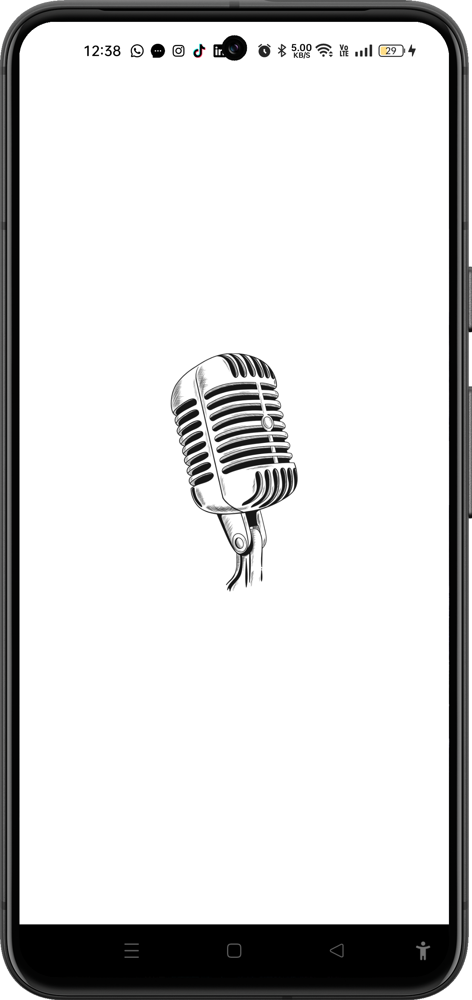
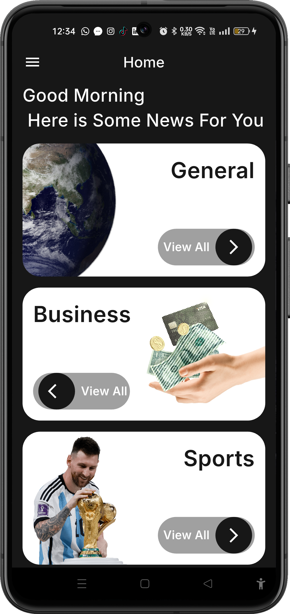
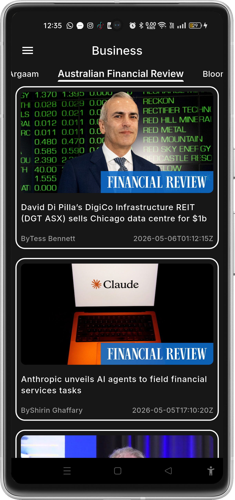
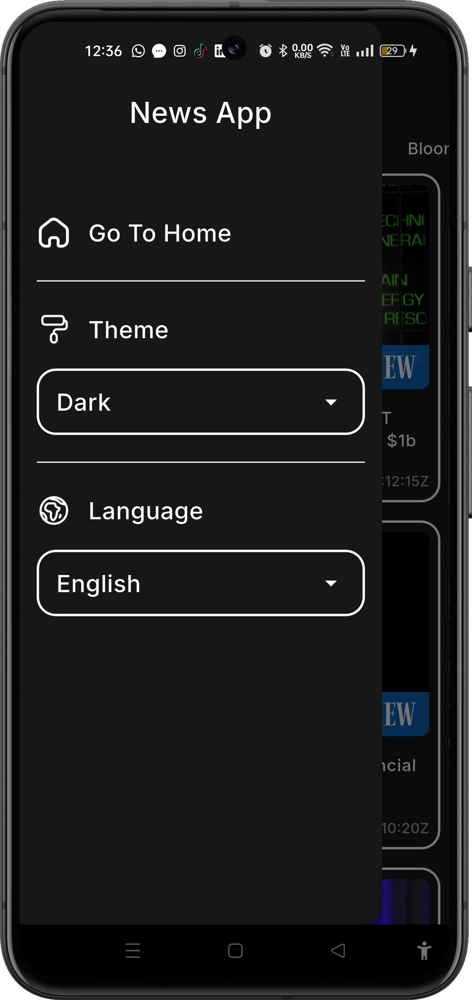

# 🗞️ Vibe News — Flutter News App

[](https://flutter.dev)
[](https://dart.dev)
[](https://pub.dev/packages/provider)
[](#-api-integration)
[](#-license)

A modern, responsive Flutter News App built with **Dart**, following **Clean Architecture principles**, and powered by **Provider** for state management and **Dio + REST API** for networking.

---

## 📌 Project Overview

**Vibe News** helps users discover and read the latest news through a clean and user-friendly interface.  
The app is designed with reusable components, scalable structure, and clean code practices for maintainability and long-term growth.

---

## ✨ Features

- 🧭 Browse news by categories  
- 🔎 Search for news articles  
- 📰 View article details  
- 🌗 Light & Dark mode support  
- 🌍 Multi-language support  
- 📱 Responsive UI across screen sizes  
- 📂 Custom Drawer navigation  
- ♻️ Reusable UI components and clean code structure

---

## 📸 Screenshots

> Replace placeholders with your final screenshots.

| Splash (Light) | Home (Dark) |
|---|---|
|  |  |

| Categories | Article List |
|---|---|
|  |  |

### Example Placeholder Markdown

```md


```

---

## 🎥 Demo / Screen Recording

- 📽️ Demo Video: **[Add your demo link here](https://example.com/demo-video)**
- 🌐 Live Preview (if web deployed): **[Add deployment link](https://example.com)**

---

## 🧱 Architecture

This project follows a **feature-first structure** and adopts **Clean Architecture principles**:

- **Presentation Layer**: UI screens/widgets + state management with Provider  
- **Data Layer**: API services, models, and remote data handling  
- **Core Layer**: Shared styles, routes, constants, utilities, and extensions

This separation improves readability, testability, and scalability.

---

## 🗂️ Folder Structure

```bash
lib/
├── api/
│   ├── dio/
│   │   └── dio_manager.dart
│   ├── api_constants.dart
│   ├── api_endpoints.dart
│   └── api_manger.dart
├── core/
│   └── utils/
├── features/
│   ├── splash_screen/
│   └── home/
│       ├── category_fragment/
│       ├── category_details/
│       ├── drawer/
│       ├── news/
│       └── widget/
├── model/
├── providers/
└── main.dart
```

---

## 🛠️ Technologies Used

| Category | Stack |
|---|---|
| Framework | Flutter |
| Language | Dart |
| Architecture | Clean Architecture (principles) |
| State Management | Provider |
| Networking | Dio + REST API |
| UI Utilities | flutter_screenutil, google_fonts |
| Image Loading | cached_network_image |

---

## 🚀 Installation & Setup

### 1) Clone the repository

```bash
git clone https://github.com/fatmanagaa/Vibe-News.git
cd Vibe-News
```

### 2) Install dependencies

```bash
flutter pub get
```

### 3) Run the app

```bash
flutter run
```

### 4) Build release (optional)

```bash
flutter build apk
```

---

## 📦 Dependencies

Main dependencies from `pubspec.yaml`:

- `provider`
- `dio`
- `http`
- `cached_network_image`
- `flutter_screenutil`
- `google_fonts`
- `flutter_native_splash`
- `cupertino_icons`

---

## 🌐 API Integration

The app consumes news content from a REST API using a dedicated networking layer:

- API constants and endpoints are centralized in `lib/api/`
- Dio-based manager handles requests and response parsing
- Model classes map JSON data into strongly typed Dart objects

This setup keeps API logic modular and easy to maintain.

---

## 🧠 State Management

The app uses **Provider** with `ChangeNotifier` for app-wide reactive state:

- `AppThemeProvider` for light/dark theme changes
- `AppLanguageProvider` for language selection and updates

Provider keeps the UI simple while enabling scalable state updates across screens.

---

## 🛣️ Future Improvements

- 🔹 Add complete article details screen flow  
- 🔹 Enhance search with filters and sorting  
- 🔹 Improve localization coverage for all app text  
- 🔹 Add offline caching support  
- 🔹 Add unit/widget/integration test coverage  
- 🔹 Add CI checks for formatting, analysis, and tests

---

## 🤝 Contributing

Contributions are welcome!

1. Fork the repository
2. Create your feature branch (`git checkout -b feature/amazing-feature`)
3. Commit your changes (`git commit -m 'Add amazing feature'`)
4. Push to the branch (`git push origin feature/amazing-feature`)
5. Open a Pull Request

---

## 📄 License

This project is currently without a declared license file.  
Add a `LICENSE` file (for example, MIT) to define usage permissions clearly.

---

## 📬 Contact

- GitHub: [@your-github-username](https://github.com/your-github-username)
- LinkedIn: [Your Name](https://www.linkedin.com/in/your-linkedin-username/)

---

## ⭐ Support

If you like this project, give it a star ⭐ and share it with others.
